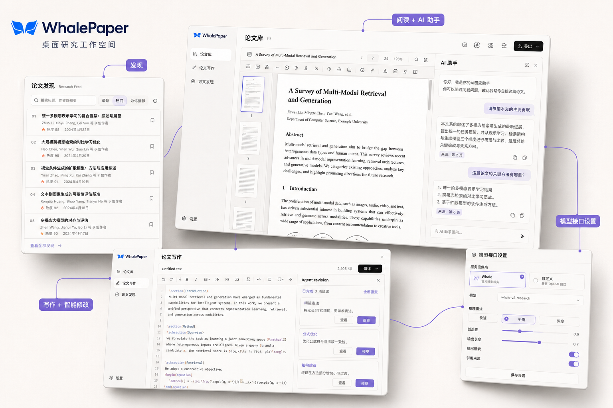
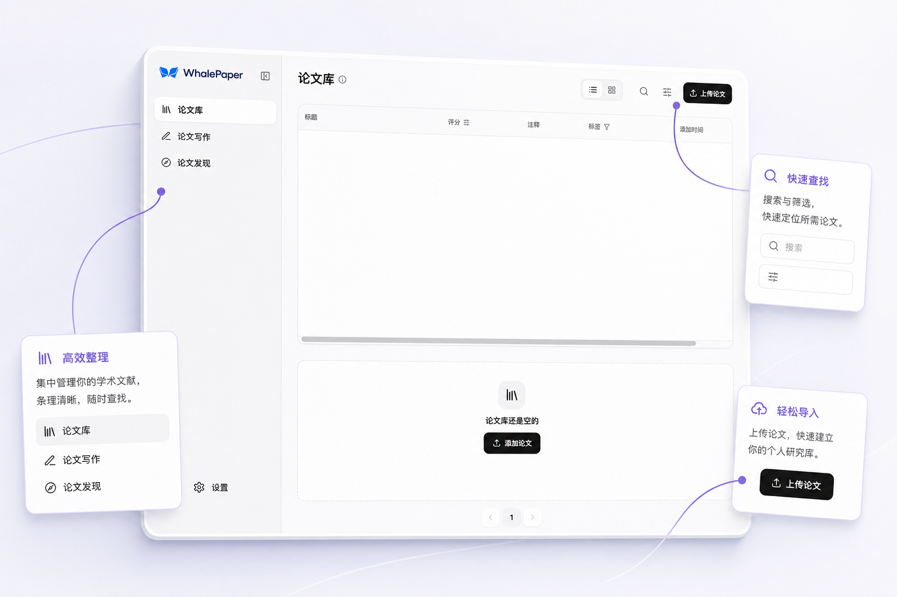
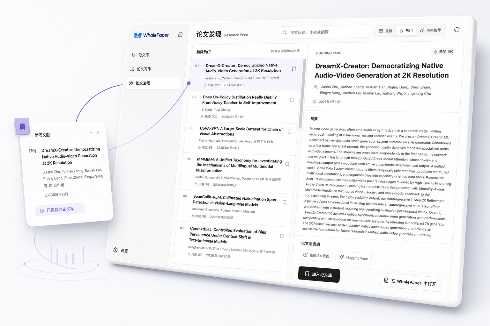
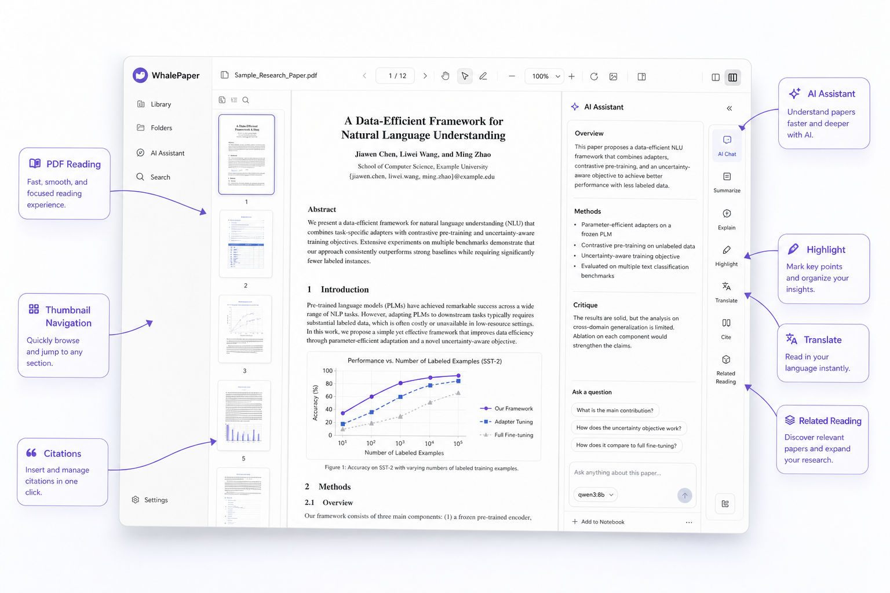
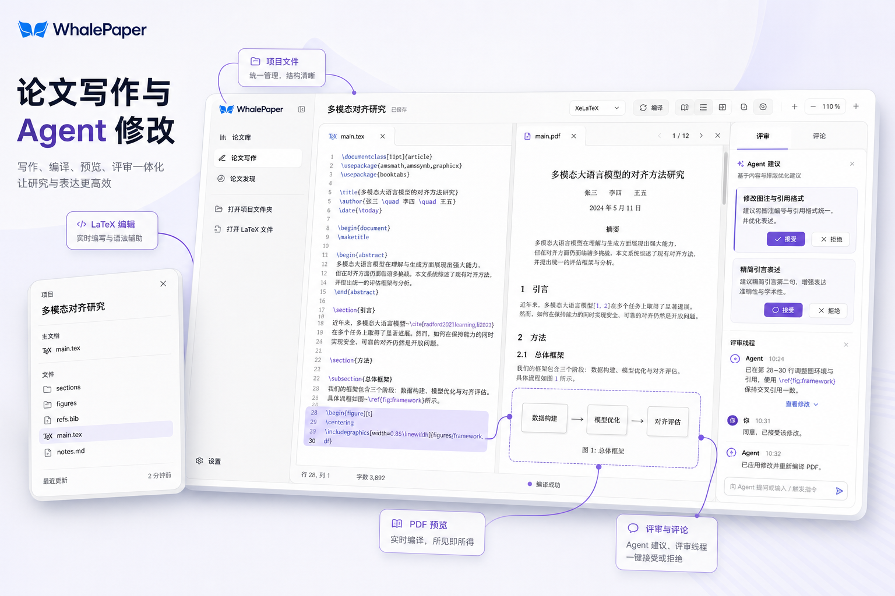
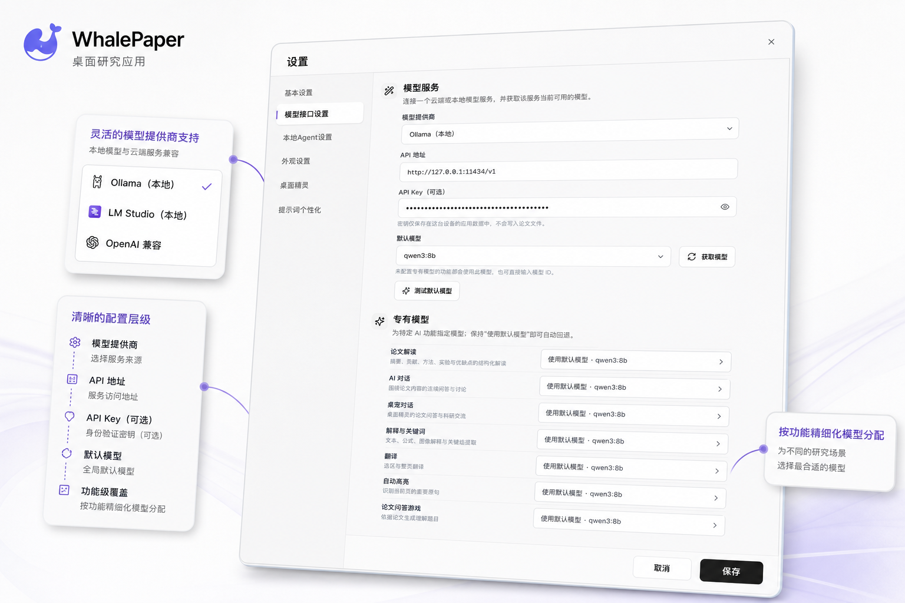
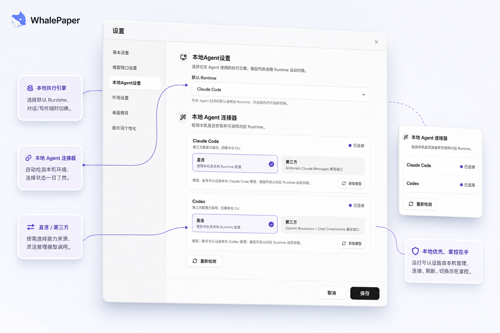
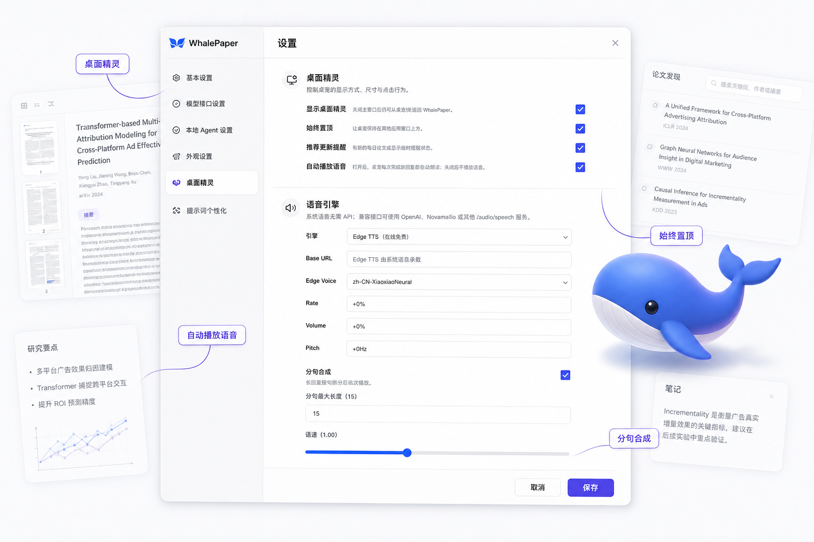

# WhalePaper

<p align="right"><a href="README_EN.md">English version</a></p>

<p align="center">
  
</p>

<p align="center"><strong>科研阅读和写作，别再来回切窗口。</strong></p>

<p align="center">
  一个本地优先的桌面科研工作空间，把论文库、PDF 阅读、AI 助手、论文发现和 LaTeX 写作放在一起。
</p>

## 为什么做 WhalePaper

一篇论文先在浏览器里找到，下载后在 PDF 阅读器里看；遇到问题，切到聊天窗口提问；有了笔记，再打开另一个工具保存；真正开始写作，又回到 LaTeX 编辑器。研究内容没有变，窗口却换了一遍又一遍。

WhalePaper 想解决的就是这件事：让论文、问题、批注和写作处在同一条线上。你可以从一篇 PDF 开始，读到哪里问到哪里，把重要内容留下来，然后继续在自己的论文里使用这些思考。

## 主要能力

- **论文库**：导入本地 PDF，按标签、评分、收藏和阅读进度整理自己的研究资料。
- **论文发现**：搜索标题、作者和摘要，浏览最新、热门和推荐论文，再将它们加入论文库。
- **PDF 阅读**：通过缩略图、目录、页码和全文搜索定位内容，支持高亮、批注、引用和导出；阅读界面的布局与交互设计受到 Moonlight 的启发。
- **AI 助手**：选中段落、公式、图像或表格，直接进行解释、翻译、提问和讨论。
- **LaTeX 写作**：打开本地项目，多标签编辑，查看编译日志和 PDF 预览。
- **Agent 修订**：让 Agent 提出具体修改，逐条查看、接受或拒绝，不会直接覆盖你的文稿。
- **模型接口设置**：连接本地、云端或自定义 OpenAI-compatible 服务，按功能选择模型。
- **本地 Runtime**：管理 Claude Code 与 ChatGPT 内置 Codex，支持直连、第三方能力和会话交接。
- **桌面精灵**：用一个轻量的小窗口快速回到 WhalePaper，提供置顶、提醒和语音控制。

## 使用演示

### 论文库

<p align="center">
  
</p>

把本地 PDF 拖进来，论文、阅读进度和批注就有了自己的位置。文件仍然保留在你选择的本地路径。

### 论文发现

<p align="center">
  
</p>

搜索标题、作者或摘要，先看清楚论文值不值得读，再收进自己的研究库。

### PDF 阅读与 AI 助手

<p align="center">
  
</p>

选中一句话就能开始提问，解释、翻译、引用和批注都留在当前阅读上下文里。AI 请求只携带当前功能需要的文本、选区或图像，不会默认上传整份 PDF。

### 论文写作与 Agent 修订

<p align="center">
  
</p>

在 LaTeX 编辑器里写作，同时看编译结果和 Agent 建议。每条修订都可以单独审阅，决定是否放进论文。

### 模型接口设置

<p align="center">
  
</p>

你可以接入本地模型、云端服务或自己的 OpenAI-compatible 接口，并为不同功能选择合适的模型。接口地址和密钥按本机保存。

### 本地 Agent Runtime

<p align="center">
  
</p>

在设置里管理 Claude Code 和 ChatGPT 内置 Codex，跟随 Runtime 获取可用模型。退出应用或切换任务时，活动 Runtime 会被停止，避免后台进程一直运行。

### 桌面精灵

<p align="center">
  
</p>

它平时安静地待在桌面边缘，需要时帮你快速回到工作区，也可以控制提醒、置顶和语音播放。

## 本地优先

- PDF 和 LaTeX 项目保留在你选择的本地路径。
- 论文库、阅读进度、批注、写作版本、Agent 会话和长期记忆保存在本机 SQLite。
- 不使用 AI 时，基础阅读、搜索和批注不需要上传文件。
- 使用 AI 时，只发送当前功能所需的页面文本、选区或明确框选的图像。
- 应用退出或切换任务时会停止活动的 Agent 进程，启动时会回收异常退出留下的运行记录。

## 开始使用

### 环境要求

- Node.js 20+
- Rust stable
- macOS 构建需要 Xcode Command Line Tools

### 从源码运行桌面版

```bash
npm ci
npm run desktop:dev
```

### 打包应用

```bash
npm run desktop:build
```

## 贡献者

WhalePaper 离不开每一位参与设计、开发和完善项目的人。

| 姓名 | 角色 | 简介 |
| --- | --- | --- |
| 芙蕖 | 项目负责人 | Datawhale 成员 |
| 王翔 | 贡献者 | Datawhale 成员 |
| 长琴 | 贡献者 | Datawhale 成员 |

也感谢所有提交 Issue、测试新版本、改进文档和提出建议的朋友。新的贡献会继续记录在这里。

## 参与贡献

无论是修正一个错别字、复现一个问题，还是实现一项新功能，都欢迎参与。

1. 在 [Issues](../../issues) 中搜索是否已有相同问题；如果没有，请新建 Issue，并尽量附上系统版本、复现步骤和截图。
2. 准备修改代码时，先在 Issue 中说明思路，避免重复工作或与现有方向冲突。
3. Fork 仓库并创建独立分支，让一次 Pull Request 只解决一个清晰的问题。
4. 提交前运行与改动相关的检查；完整检查命令可以在下方“开发者信息”中找到。
5. 发起 [Pull Request](../../pulls)，说明改了什么、为什么这样改，以及如何验证。

除了代码，我们同样欢迎界面设计、使用反馈、文档、翻译和测试方面的贡献。如果 Issue 或 Pull Request 长时间没有回复，可以联系 [Datawhale 开源项目维护团队](https://github.com/datawhalechina/DOPMC/blob/main/OP.md) 协助跟进。

## 联系我们

- 遇到 Bug 或有功能建议，请优先提交 [Issue](../../issues)。公开讨论能让后来遇到相同问题的人也找到答案。
- 希望直接参与开发，可以发起 [Pull Request](../../pulls)，或先在 Issue 中介绍你的想法。
- 想了解 Datawhale 的其他开源项目，或希望发起新项目，可以阅读 [Datawhale 开源项目指南](https://github.com/datawhalechina/DOPMC/blob/main/GUIDE.md)。

<p align="center">
  <strong>关注 Datawhale</strong><br>
  <sub>扫描二维码获取开源项目动态</sub><br><br>
  
</p>

## 开发者信息

<details>
<summary>构建检查、项目结构与许可证</summary>

### 本地发布前检查

项目不依赖 GitHub Actions。发布前可以在本机运行：

```bash
npm run check:repository
npm run build
npm run verify:structured-json
npm run verify:quiz
npm run verify:pdf-export
cargo fmt --manifest-path src-tauri/Cargo.toml -- --check
cargo clippy --manifest-path src-tauri/Cargo.toml --all-targets -- -D warnings
cargo test --manifest-path src-tauri/Cargo.toml
```

如需检查依赖安全公告，可以额外运行：

```bash
npm audit --audit-level=high
```

### 项目结构

```text
src/                    React 界面、阅读功能和本地服务适配器
src/features/writer/    LaTeX 写作工作区、Agent 修订和版本服务
src-tauri/src/          Tauri 命令、SQLite、Runtime 与 LaTeX 管理
src-tauri/resources/    内置模型、会议 LaTeX 工具包和许可文件
public/                 桌面精灵等静态资源
assets/readme/          README 宣传图
scripts/                本地检查和发布回归脚本
```

### 技术栈

- React 19、TypeScript、Vite
- PDF.js / react-pdf、PDF-Lib、KaTeX
- CodeMirror LaTeX 编辑器
- Tauri 2、Rust、SQLite
- 本地或云端 OpenAI-compatible 模型服务
- Claude Code 与 ChatGPT 内置 Codex Runtime（可选）

### License

WhalePaper 自有代码采用 MIT License。PDF.js 采用 Apache-2.0。内置 DocLayout-YOLO 模型声明为 AGPL-3.0，完整许可文本位于 `src-tauri/resources/models/LICENSE.DocLayout-YOLO.txt`。会议 LaTeX 工具包和其他资源保留各自的上游版权与许可条款；公开发布二进制安装包前，请确认相应的再分发义务。桌面精灵资源来自 Agent Pet 项目并采用 MIT License。

</details>

如果 WhalePaper 对你的科研工作有帮助，欢迎点一个 Star，让更多需要论文阅读和写作工作台的人找到它。
