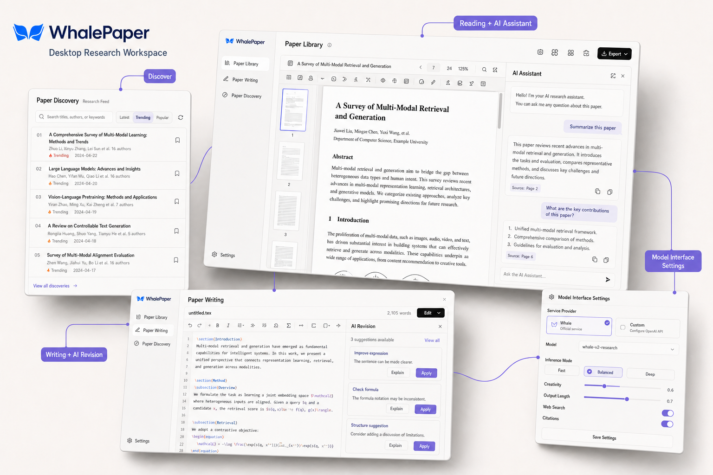
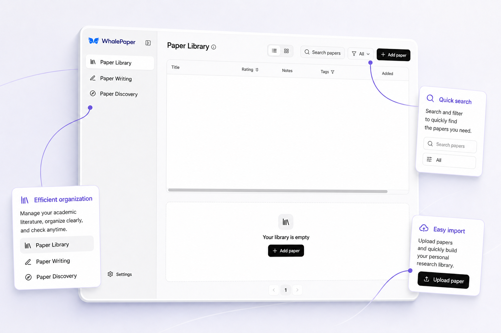
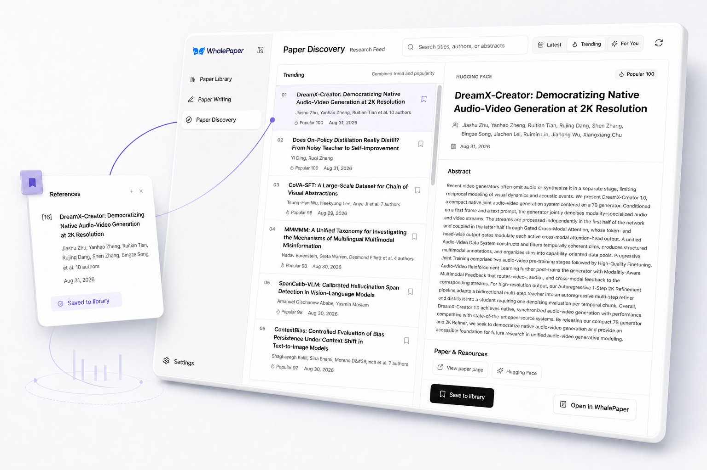
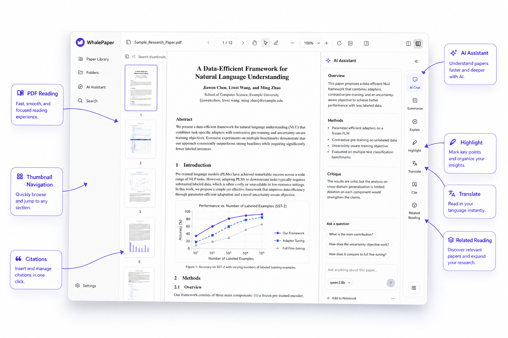
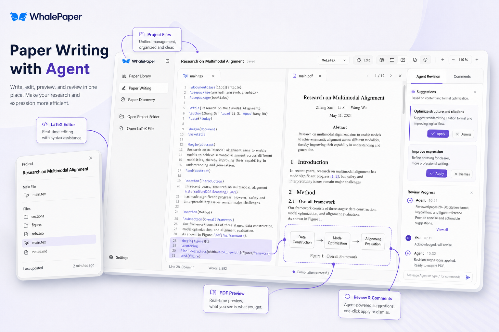
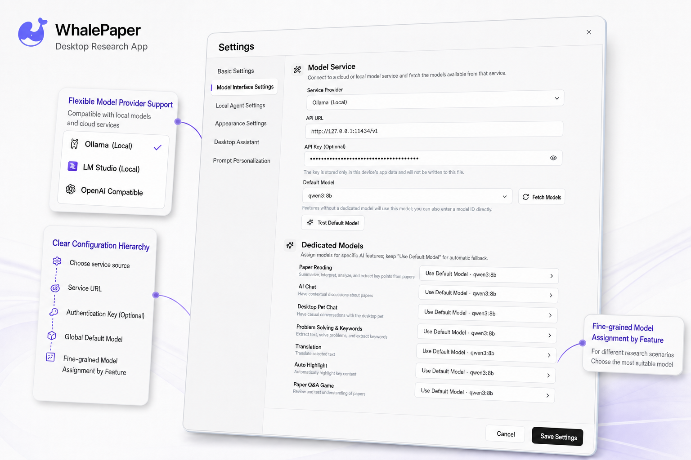
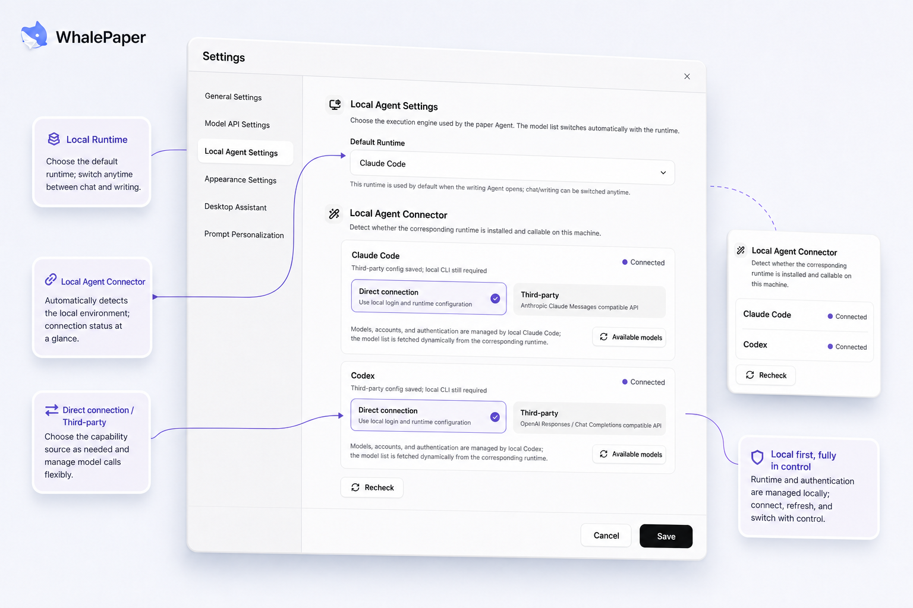
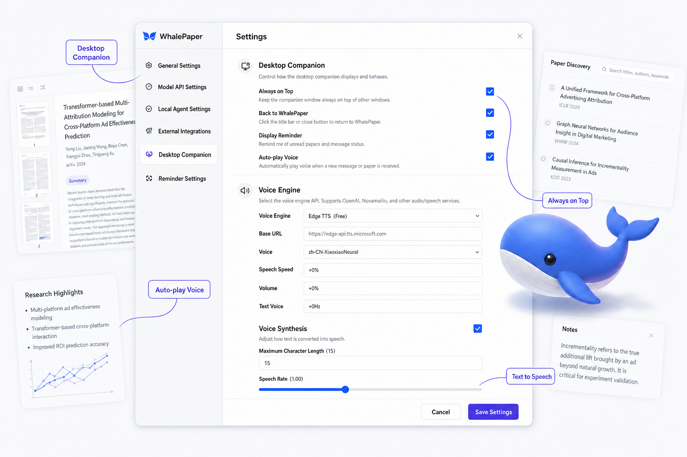

# WhalePaper

<p align="right"><a href="README.md">中文版</a></p>

<p align="center">
  
</p>

<p align="center"><strong>Research reading and writing, without the window hopping.</strong></p>

<p align="center">
  A desktop workspace that brings your paper library, PDF reader, AI assistant, paper discovery, and LaTeX writing together.
</p>

## Why WhalePaper

You find a paper in the browser, read it in a PDF viewer, switch to a chat window when something is unclear, open another app for notes, and finally return to a LaTeX editor when it is time to write. The research stays the same; only the windows keep changing.

WhalePaper keeps those steps together. Start with a PDF, ask questions while you read, save the ideas that matter, and carry them into your own paper when you start writing.

## What it includes

- **Paper library**: Import local PDFs and organise them with tags, ratings, favourites, and reading progress.
- **Paper discovery**: Search titles, authors, and abstracts; browse recent, popular, and recommended papers; add them to your library.
- **PDF reading**: Navigate with thumbnails, the table of contents, page numbers, and full-text search. Highlight, annotate, cite, and export. The reader layout and interaction design were inspired by Moonlight.
- **AI assistant**: Select a paragraph, equation, image, or table to explain, translate, discuss, or ask about it.
- **LaTeX writing**: Open a local project, edit multiple files in tabs, and inspect the compile log and PDF preview.
- **Agent revisions**: Ask an Agent for concrete changes and review each suggestion before accepting or rejecting it.
- **Model interface settings**: Connect local, hosted, or custom OpenAI-compatible services and choose models per feature.
- **Local Agent Runtime**: Manage Claude Code and ChatGPT's built-in Codex with direct or third-party connections and session handoff.
- **Desktop companion**: Keep a small helper on the edge of the desktop for quick access, reminders, pinning, and voice controls.

## See it in action

### Paper library

<p align="center">
  
</p>

Drop in a local PDF and give it a place in your research library. Your reading progress and annotations stay with it, while the file remains at the local path you chose.

### Paper discovery

<p align="center">
  
</p>

Search by title, author, or abstract, decide what is worth reading, and add it to your library when you are ready.

### PDF reading with an AI assistant

<p align="center">
  
</p>

Select a sentence and start asking. Explanations, translations, citations, and annotations stay close to the passage you are reading. AI requests use the text, selection, or image needed for the current action rather than uploading the whole PDF by default.

### LaTeX writing and Agent revisions

<p align="center">
  
</p>

Write in the LaTeX editor while checking the compiled result and Agent suggestions beside it. Review each revision on its own and decide whether it belongs in the paper.

### Model interface settings

<p align="center">
  
</p>

Connect a local model, a hosted service, or your own OpenAI-compatible endpoint, then pick the right model for each feature. Endpoint details and keys are stored locally.

### Local Agent Runtime

<p align="center">
  
</p>

Manage Claude Code and ChatGPT's built-in Codex from settings and follow each Runtime's available models. Active Runtimes stop when the app exits or you switch tasks, so background processes do not keep running indefinitely.

### Desktop companion

<p align="center">
  
</p>

It stays quiet at the edge of your desktop until you need it, then gets you back to the workspace and controls reminders, pinning, and voice playback.

## Local-first by default

- PDFs and LaTeX projects stay at the local paths you choose.
- The paper library, reading progress, annotations, writing versions, Agent sessions, and long-term memory are stored in local SQLite.
- Basic reading, search, and annotation work without uploading files when AI is not being used.
- AI features send only the page text, selection, or explicitly selected image needed for the current action.
- Active Agent processes stop when the app exits or a task is switched, and stale run records are reclaimed at startup.

## Getting started

### Requirements

- Node.js 20+
- Stable Rust
- Xcode Command Line Tools for macOS builds

### Run the desktop app from source

```bash
npm ci
npm run desktop:dev
```

### Package the app

```bash
npm run desktop:build
```

## Contributors

WhalePaper is shaped by everyone who helps design, build, test, and improve it.

| Name | Role | About |
| --- | --- | --- |
| 芙蕖 | Project lead | Datawhale member |
| 王翔 | Contributor | Datawhale member |
| 长琴 | Contributor | Datawhale member |

Thanks as well to everyone who reports issues, tests new versions, improves the documentation, or shares an idea. New contributions will continue to be recognised here.

## Contributing

Contributions of any size are welcome, from fixing a typo or reproducing a bug to building a new feature.

1. Search [Issues](../../issues) for an existing report. If you open a new one, include your system version, reproduction steps, and screenshots when possible.
2. Before making a larger code change, describe the approach in an Issue so the work can be discussed and does not conflict with an existing direction.
3. Fork the repository and create a focused branch. Keep each Pull Request limited to one clear change.
4. Run the checks relevant to your change before submitting. The complete local check list is available under “Developer information” below.
5. Open a [Pull Request](../../pulls) explaining what changed, why it changed, and how you verified it.

Code is only one way to help. UI design, product feedback, documentation, translation, and testing contributions are equally welcome. If an Issue or Pull Request has not received a response for some time, the [Datawhale open-source maintenance team](https://github.com/datawhalechina/DOPMC/blob/main/OP.md) can help follow it up.

## Contact

- For bugs and feature requests, please open an [Issue](../../issues). Public discussion leaves an answer for the next person with the same problem.
- To contribute code, open a [Pull Request](../../pulls), or describe your idea in an Issue first.
- To explore other Datawhale projects or propose a new one, see the [Datawhale Open Source Project Guide](https://github.com/datawhalechina/DOPMC/blob/main/GUIDE.md).

Join the WhalePaper technical discussion and beta-testing group to share feedback, feature ideas, and questions. The QR code is time-limited and will be replaced in the repository when it expires.

<table>
  <tr>
    <td align="center" width="50%">
      <strong>Join the WhalePaper group</strong><br>
      <sub>Technical discussion, beta feedback, and releases</sub><br><br>
      
    </td>
    <td align="center" width="50%">
      <strong>Follow Datawhale</strong><br>
      <sub>Scan the QR code for open-source project updates</sub><br><br>
      
    </td>
  </tr>
</table>

## Developer information

<details>
<summary>Checks, project layout, and licensing</summary>

### Local release checks

This project does not use GitHub Actions. Run the checks locally before publishing:

```bash
npm run check:repository
npm run build
npm run verify:structured-json
npm run verify:quiz
npm run verify:pdf-export
cargo fmt --manifest-path src-tauri/Cargo.toml -- --check
cargo clippy --manifest-path src-tauri/Cargo.toml --all-targets -- -D warnings
cargo test --manifest-path src-tauri/Cargo.toml
```

For dependency security advisories:

```bash
npm audit --audit-level=high
```

### Project layout

```text
src/                    React UI, reading features, and local service adapters
src/features/writer/    LaTeX workspace, Agent revisions, and version services
src-tauri/src/          Tauri commands, SQLite, Runtime, and LaTeX management
src-tauri/resources/    Bundled models, conference LaTeX kits, and licenses
public/                 Desktop companion and other static assets
assets/readme/          README promotional images
scripts/                Local checks and release regression scripts
```

### Technology

- React 19, TypeScript, Vite
- PDF.js / react-pdf, PDF-Lib, KaTeX
- CodeMirror LaTeX editor
- Tauri 2, Rust, SQLite
- Local or hosted OpenAI-compatible model services
- Claude Code and ChatGPT's built-in Codex Runtime (optional)

### License

WhalePaper's own code is released under the MIT License. PDF.js is Apache-2.0. The bundled DocLayout-YOLO model is declared AGPL-3.0; the full license text is in `src-tauri/resources/models/LICENSE.DocLayout-YOLO.txt`. Conference LaTeX kits and other resources retain their upstream licenses and copyright terms. Confirm the applicable redistribution obligations before publishing packaged binaries. Desktop companion assets come from the Agent Pet project and are licensed under MIT.

</details>

If WhalePaper helps with your research, consider leaving a Star so other researchers looking for a focused reading and writing workspace can find it.
